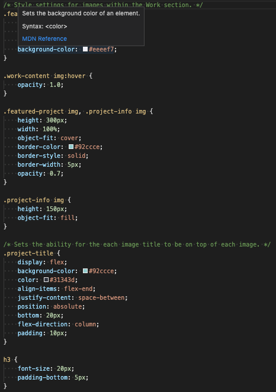

# Portfolio

## UW CODING BOOT CAMP HOMEWORK 02

## Summary
Here you will find my current portfolio as a web developer. All of which will contain past, current, and future projects that I have built and will be building since I started UW Coding Bootcamp in September 2020.

Current projects are still a work in progress. Thus most/all images you will see are acting as my placeholders.

This project will serve as the Portfolio I will be using for future job prospects, which will continuosly be edited, updated, and improved on as I continue to build on my coding skills through this program.

## Links
1. [Github Repository](https://github.com/jkaganovsky/Portfolio)
1. [Deployed Website](https://jkaganovsky.github.io/Portfolio/)

## Content and Description: CSS and HTML
Here is my thought process for building this website:
First container, I set as -
* Container A: Header
    - And then I've included the following within this container -
    1. Background
        * Main image background
        * Background color
        * Font-Family
    1. Links
        * href tags
        * Alignment is fixed at the top-right of the page
        * Links directly to the id tags on the body section
        * Evenly spaced for readability
    1. Name
        * Set at a certain font-size
        * Alignment is fixed at the top-left of the page
        * Background and font color opposite that of Links
    1. Title
        * Same background and font color as Name
        * Alignment is fixed on the bottom-right of the header
        * Padding
    1. Self-Portrait
        * Styling different from a regular square block

HTML

CSS

Second container, I set as -
* Container B: Body
    - And then I've set 3 sub-containers to style easily -
    1. About Me
        * Descriptive paragraph
    1. Work
        * 5 Images (with a featured project larger than the other 4 images)
        * Subtitles (sits on top of each image)
        * Hover (opacity changes when mouse hovers on each image)
    1. Contact Me
        * Links

HTML

CSS

## Credits
Websites I constantly referred to in order to understand how flexbox works:
1. https://css-tricks.com/snippets/css/a-guide-to-flexbox/
1. https://www.w3schools.com/css/css3_flexbox.asp

## License
MIT License

Copyright (c) [2020] [Jailanie Kaganovsky]

Permission is hereby granted, free of charge, to any person obtaining a copy
of this software and associated documentation files (the "Software"), to deal
in the Software without restriction, including without limitation the rights
to use, copy, modify, merge, publish, distribute, sublicense, and/or sell
copies of the Software, and to permit persons to whom the Software is
furnished to do so, subject to the following conditions:

The above copyright notice and this permission notice shall be included in all
copies or substantial portions of the Software.

THE SOFTWARE IS PROVIDED "AS IS", WITHOUT WARRANTY OF ANY KIND, EXPRESS OR
IMPLIED, INCLUDING BUT NOT LIMITED TO THE WARRANTIES OF MERCHANTABILITY,
FITNESS FOR A PARTICULAR PURPOSE AND NONINFRINGEMENT. IN NO EVENT SHALL THE
AUTHORS OR COPYRIGHT HOLDERS BE LIABLE FOR ANY CLAIM, DAMAGES OR OTHER
LIABILITY, WHETHER IN AN ACTION OF CONTRACT, TORT OR OTHERWISE, ARISING FROM,
OUT OF OR IN CONNECTION WITH THE SOFTWARE OR THE USE OR OTHER DEALINGS IN THE
SOFTWARE.

